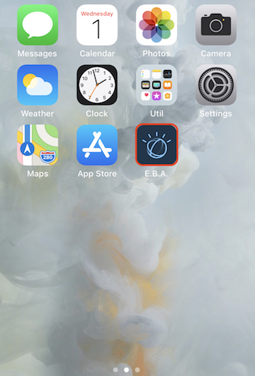

### Mobile web integration

While EBA does not currently offer a native iOS application, it can be added as a mobile web application to your device's home screen. To add EBA mobile to your iphone, follow the steps below.

- Navigate to eba.ibm.com on your iPhone.
- In your browser select the share icon and select the option titled 'Add to Home Screen'.
- A window will popup asking you to name the application, which default to 'E.B.A'.
- Click 'Add'.

EBA will now be added to your home screen and easily accessed via it's app icon as shown below.

