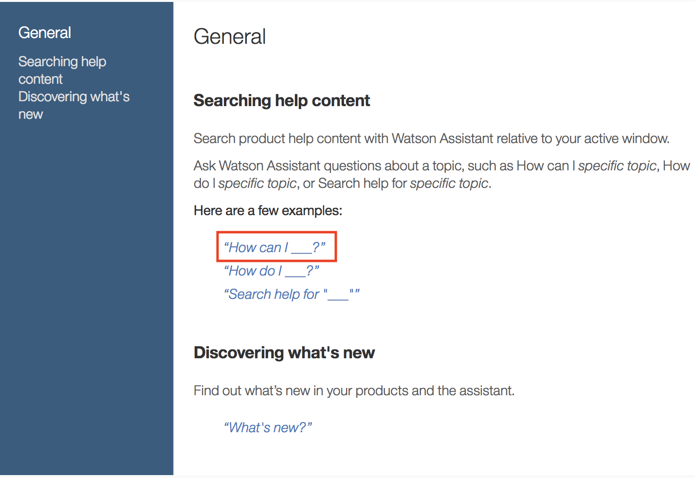
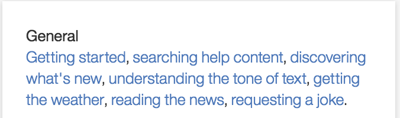

## General tab

### Description

The description is a useful place to describe your agent skill as well as the sorts of questions that it supports. It is designed to serve as an initial reference when sharing and collaborating with others.

By clicking the edit button, you will be able to enter custom markdown(MD) in a code editor. For more details on what type of MD is support, check out the section [Online Help](#online-help) below. Once you apply these changes, you will immediately see these changes reflected. 

The preview of the description is displayed at the [lab view](https://eba.ibm.com/assistant#/lab). In addition, the complete description is shown once you click on an agent to see the details and to access further actions:
 - view (or edit) in lab
 - delete the agent
 
Typical information to be present in the description:

**Overview**
 - Brief description of the skill(s) and working scenarios.
 - Type of questions the agent can answer

**Dependencies**
 - List dependencies which are required by the agent (e.g. [concepts](./../components/Ontology.md) provided by other agents)
 
**Support Information**
 - concept prefix -- see [Ontology](./../components/Ontology.md) for details.
 - Owner of the agent (Name and Contact options)

### Settings

Settings is a useful place to specify agent specific key-value parameters. These parameters will be accessible to the agent later in the action development pipeline via function input parameters.

```
const settingValue = params.settings[<key>]
```
Settings are part of the agent YAML file and can be exported.

### Secrets
Secrets should be used to store hidden parameter values. It may be used to store credential information, such as API keys. Secrets are part of the function input parameters.

```
const secretValue = params.secrets[<key>]
```
Only the secrets `key` is part of the YAML file and will be exported. The values must be added each time the agent is imported.

### Endpoints

EBA provides developers with control over various stages of its execution pipeline. Endpoints represent different processes that developers can utilize to achieve different behaviors suitable to their particular application. We support the following endpoints:

- [@start](./endpoints/Start.md): session initialization process which can be useful for initializing certain resources.
- [@annotate](./endpoints/Annotate.md): annotation process by which concepts are introduced into the syntax tree.
- [@force](./endpoints/Force.md): lazy data execution process which converts lazy meta information into real data
- [@react](./endpoints/React.md): event handling process for evaluating and dispatching incoming events
- [@render](./endpoints/Render.md): rendering process used for formatted responses to external channels (Slack and Watson Workspace)
- [@api](./endpoints/API.md): api registration process for enabling backend operations to be executed within frontend assets

### Online Help
The online help is input for the *skills* tab (next to the content tab). All collaborating agents are contributing to the online help which will be displayed at the [skills tab](https://eba.ibm.com/assistant#/help).

If you are looking for a full blown example check out the following [code snippet](./../assets/resources/full_online_help.snippet) which can be copied and pasted directly into the Online Help code editor.  

The online help is using a YAML structured text in the following way:

```
- priority: 1
  title: Main Section Title
  sections:
    - title: Section Title 1
      description: >
        Tnis line will be shown as preview message for this agent.

        Additional description to be displayed on the General Tab.
      examples:
        - Example Question 1
    - title: Section Title 2
      description: >
        Another description
      examples:
        - Example Question 2
```

  
 * `priority`  
 influences the position within the section(s) headline. If you are experiencing an issue with the position on how your agent help is displayed, try changing this to a lower (will result into a higher position) or a higher (will result into a lower position) value.
 * `title`  
 Refers to the section title. If you would like to display the agents online help below an existing section title just use the same title e.g. `title: General` to get your entry added to the same main section title **General**
 * `sections`  
 The following entries can be repeated per section entry  
    * `title`  
    The headline of the skill described within this section.
    * `description`  
    The main [Github markdown](https://guides.github.com/features/mastering-markdown/) is supported.  
	There are some **exceptions** which includes the following
	limitations:  
	- Syntax highlighting  
	- Task Lists  
	- SHA references  
	- Issue references within a repository  
	- Username @mentions  
	- Automatic linking for URLs  
	- Emoji
	
    * `examples`  
    A list of sample questions the agent is supporting. Each line should contain one supported question.

```  
 examples:
   - Example Question 1
   - Example Question 2
   - Example Question 3 with a variable user input __!
```

Each entry will be transformed into a link. If a user clicks on this link the sample question is copied into the `Ask Watson` input text field to post an agent question.

**Tip**  
If you have variable input, e.g. `"Show me the details for order with id 123"` you can create the following example questions:
`"Show me the details for order with id __"`

The pattern '\__' creates a placeholder. If the user clicks on this sample question the text is copied over and the pattern '\__' is highlighted. The user just need to type the placeholder value (here: 123) and hit enter to ask the assistant the complete question.

The *Example Question 3* uses exactly the described pattern. 
A working example can be pulled from the [documentation agent](https://eba.ibm.com/assistant#/help/general/searching-help-content).




In addition asking the assistant the question `help me` will display a list of available agent skills.


