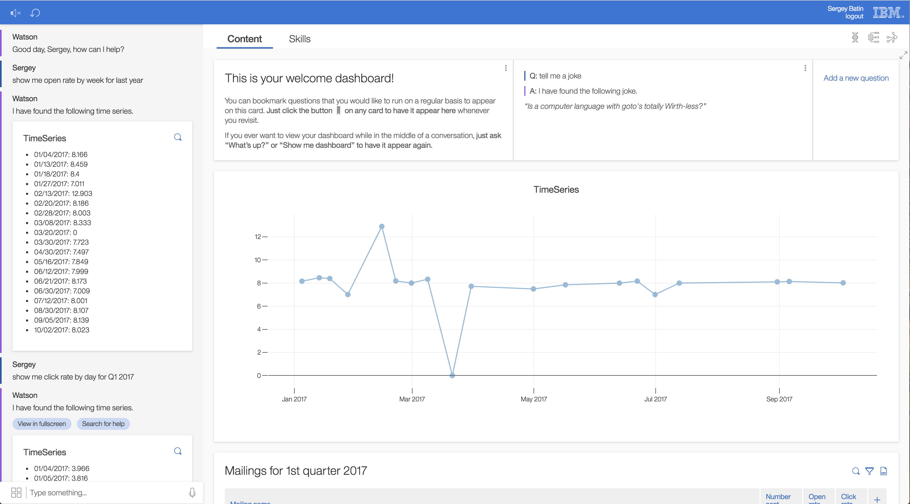

## Plotly chart

We support a component which allows developers to create and customize Plotly charts. This component will load the Plotly library and expose a couple of props which allow for customization. In particular, it will accept the following props:

* `layout` -- a javascript object containing layout information such as xaxis, yaxis, margins, and title.
* `traces` -- a list of javascript objects containing directives on how to trace your chart, such as x and y coordinates, chart type, mode, markers, and hover info.

Note that CSS `styles` can be provided as props.

An example of `layout` can be:
```
layout =
    title: "Relation of #{column1.name} and #{column2.name}"
    xaxis: title: column1.name
    yaxis: title: column2.name
    margin:
        l: leftMargin
```

An example of `traces` can be:
```
type: "scatter"
x: values1
y: values2
hoverinfo: "x+y"
mode: "markers"
marker:
    size: 10
    opacity: 0.5
```

Below is an example which illustrates how to create this component programatically to model a timeseries chart.

```
# values is a list of coordinate pairs
xs = _.map(values, ([x, y]) -> x)
ys = _.map(values, ([x, y]) -> y)

trace =
    type: "scatter"
    x: xs
    y: ys
    opacity: 0.5
    marker:
        size: 10

layout =
    title: "TimeSeries"

React.createElement PlotlyChart,
    traces: @state.traces
    layout: @state.layout
```

A screen shot of this visualuzation in action is below.

[](../timeseries-cahrt.png)
