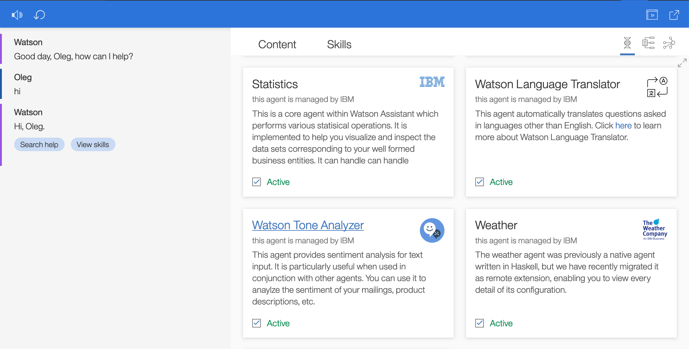

## Agent level activation and deactivation

We are proud to announce a new feature to our users--the ability to activate and deactivate entire agents. EBA is, by design, a collaborative ecosystem, where multiple agents help contribute various domain knowledge. By releasing this feature, developers and users have fine-grained control over which agents are in place for a given session. The screen shot below provides an illustrates the activation component for each agent. By navigating to the [agents tab](https://eba.ibm.com/assistant#/lab/agents), you can try out this feature for yourself. Since we prefer to keep EBA as an open system, we have even provided the ability to deactivate native, core agents. 

### Some use cases to consider

This is particulary useful in cases where a developer is implementing multiple agents and would like to toggle between their functionality. Rather than manually deleting and reimporting agents (including their secrets), develoeprs can now simply deactivate their agents and keep them in the background.

Another relevant use case includes developing a new agent which has overlapping domain with an exisitng agent; for example, you may wish to provide a custom implementation of the Weather domain. By deactivating the native Weather agent, any potential interference is eliminated.

Lastly, this feature can potentially be leveraged for users who are subscribed to multiple business areas, e.g. marketing and supply chain. Wearing my marketering hat, I can deactivate the supply chain agent, or, wearing my supply chain hat, I can deactivate the marketing agent. Of course, we would only encourage this in the case of any detected ambiguity or interference between the two agents, otherwise you will lose the potential to have these agents collaborate, which makes sense in certain enterprise settings.
