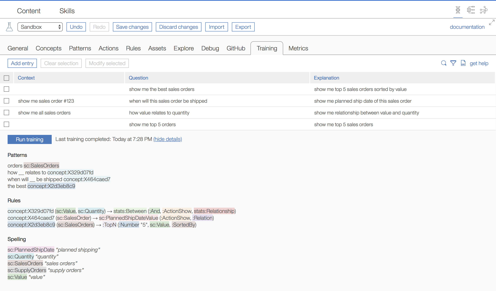

## EBA agent training

EBA team is announcing _agent training_--a feature which can have wide effects on agents and developers alike. Represented as a table within our development lab, agent training allows developers to teach their agents new patterns, rules, and spellings using natural langauge only. This _trained_ knowledge becomes part of the agent itself, just as if it were programatically developed, making it completely portable. Consequently, this feature intimates a shift in paradigm for developers. It allows them to implement the most atomic and essential elements of their agent, while leaving more high level and complex cases of NLU to be built on top of this through the use of NL training.

### How to train your agent

Training is comprised of a set of entries, where each entry is a triple consisting of an optional context, a question, and a more detailed explanation of the question. Training set entries are processed one entry at a time, from top to bottom. This means that, for instance, having explained to the system what 'the best mailing' means, we can reuse this expression in the explantation of a subsequent entry.

To clarify, you should keep in mind the role of each element within this triple:
- *context* -- any existing context which is required for the question and explanation. This is particularly useful for cases where a direct or indirect reference is used to refer to prexisting entities, e.g. 'those mailings' or 'this order'.
- *question* -- the high level question or paraphrase you want the system to understand. This question can contain new words and concepts not previously expressed within the agent.
- *explanation* -- the atomic and lower level explanation to your question. Developers should take care to ensure that the explanation is correctly understood by the machine. Running your explanation in the chat with the suffix `||debug` will allow you to verify the system's understanding.
  
### How it works

When EBA trains a single entry, EBA will process both the question and the explanation using its classical reasoning. Afterwards, EBA is able to infer which part of the target question differs from the explanation. This part which differs requires additional knowledge, which EBA can now attain using the supplied explanation. As an example, consider the first entry in the visualization above. We state that a question such as 'show me the best sales orders' can be _explained_ as 'show me top 5 sales orders sorted by value'. We note that the part of the original question which requires understanding is the notion of the term 'best'. The remaining parts of the sentence are understandable by EBA, viz. 'show me' and 'sales orders'. From a classical development perspective, we know that to encode such a question manually, we must implement a pattern for the NL term 'best', and, additionally, we must supply some rewriting rule to signify its semantic meaning. Our system can handle this task. The pattern can be derived from the question and the semantic rule can be derived from the explantation.

This explains why you see the following pattern and rule in the training results:

- `[the best](concept:Hash)` 
- `concept:Hash(:SalesOrders) -> :TopN(:Number, :Value, :SortedBy)`.

Note that concepts which are auto generated by our system have no human readable name, as they represent intermediate concepts generated by a machine. They will be represented by the prefix `concept` and as well as a hash code.
