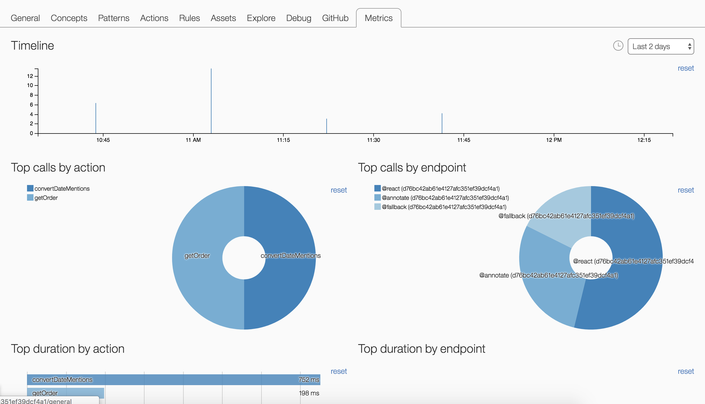

## Agents Metrics

The EBA team has released a feature to monitor the metrics of different agents across your system. These metrics allow you to inspect fine details of agent performance for different metrics at different points in time. These metrics are useful in the collaborative reasoning ecosystem which EBA operates in. It allows you to inspect the top callers for different parts of our execution pipeline to identify an anamolies among your agents. Unlike the [execution workflow](./ExecutionWorkflow.md), these metrics target the overall historical performance of an agent, rather than its timeline for executing a particular question.

