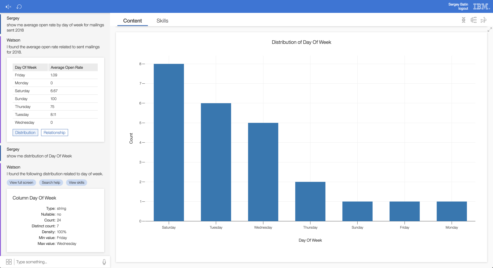

## Attribute based grouping

EBA's statisical agent now has the ability to group metrics for a collection by any arbitrary attribute. As we see in the image below, users may ask for the average open rate by day of week for a set of mailings. This is a case where a certain metrics, viz. open rate, is aggregated across all mailings. With this release, we can now partition or group this metrics by another attribute which belongs to a mailing, viz. the day of week it was sent. Following this pattern, other examples can include asking for the average price of a product by its category or asking for a the value of a shipment grouped by its status.

