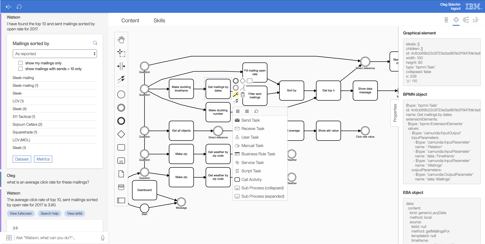

## BPMN UI tooling

We are glad to release, in preview mode, our first version of [BPMN tooling](https://eba.ibm.com/assistant?preview#/bpmn) within EBA. This tooling includes an execution flow of interactions with your assistant, as well as UI widgets for managing processes within this flow. The beauty of EBA is that it formalizes your business domain into a set of concepts and actions. These concepts and actions, in turn, serve as the building blocks for identifying and consuming _processes_ or a set of repeated, useful interactions. Creating and managing these processes is big step forward in your assistant's ability to automate its assistance. You are welcome to preview this tooling, just bear in mind that it currently has no effect beyond presentation.

