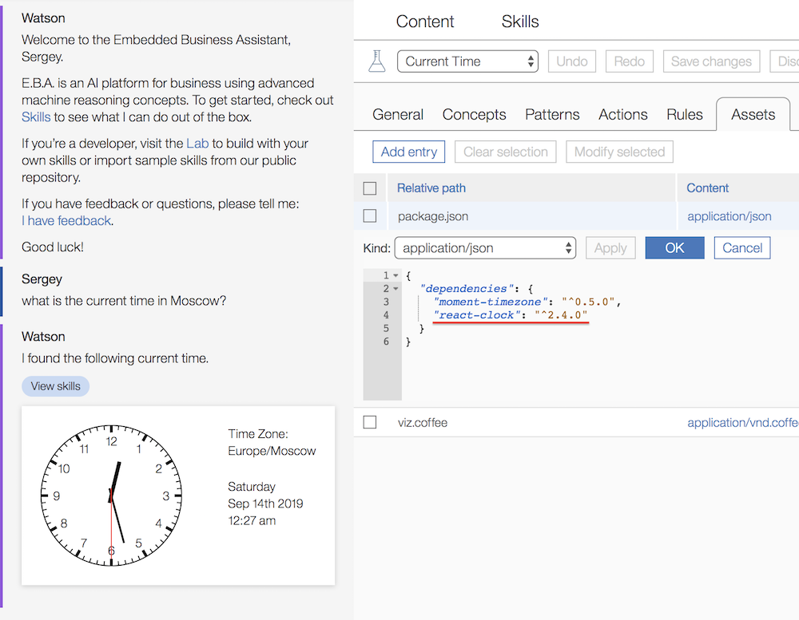

## Import third party client side libraries

In the course of developing their agents, EBA developers may need to make use of external libraries which are not provided out of the box by our system. So far the ability to include any third party module was only supported for backend assets. This is now supported for client side modules as well, meaning that developers can leverage existing third party React components in the course of developing their data visualizations. Below is an illustration of [react-clock](https://www.npmjs.com/package/react-clock), a module for creating various clocks. 


### How it works

As described in our [package.json release](Packagejson.md), third party modules can be declared in a package.json file. Our system will download and bundle these assets along with the agent. The only requirement is that the agent utilizes [Webpack bundling](WebpackAssets.md). Afterwards, developers will be able to `require` their third party modules and utlize them within their own source files. Note that not all third party modules are universally are supported, as some may require additional global requirements, e.g. a certain compiler.

An illustration of package.json for react-clock:

```
{
  "dependencies": {
    "react-clock": "^2.4.0"
  }
}
```

An illustration of requiring this component within a source file:

```
import Clock from 'react-clock'

export class time_CurrentTimeData extends PureComponent
  constructor: (props) ->
    super props
    @state = { date: new Date() }

  componentDidMount: ->
    updateTime = () => @setState({ date: new Date() })

    timer = setInterval(updateTime, 1000)
    @setState({ timer })
    
  componentWillUnmount: ->
    clearInterval(@state.timer)
  
  render: ->
    React.createElement Clock, value: @state.date, renderNumbers: true
```

[](../images/react-clock-example.png)
