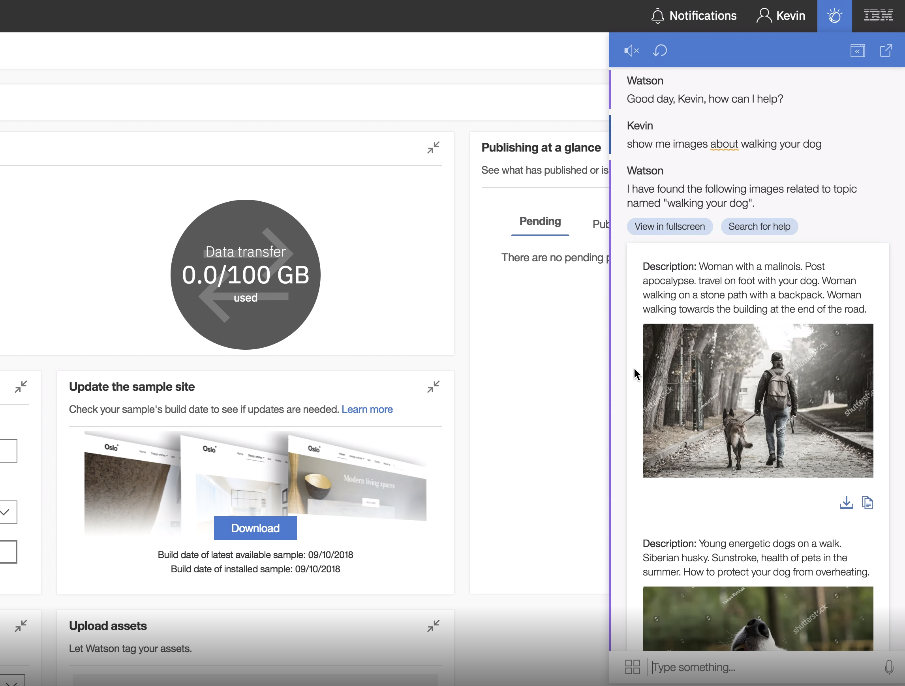

## FreeText

We have released a new core feature--the ability to use arbitrary text in semantic actions. Last year many developers asked us to support actions which would be able to take part of a sentence as an input. Our _de facto_ suggestion was to either use known names or quoted strings to achieve this. This is because an essential requirement on the part of EBA reasoning is that all the possible meanings of a sentence must annotated in advance. However, there is a way to consume a part of a sentence which was not claimed by any of actions we are going to execute--text which is _free_. We consider this as a safe assumption as all other parts of a sentence can be encoded as proper knowledge. In light of these considerations, we have created a new concept called `:FreeText`. Like `:UserString`, which is explicitly denoted by quotation marks, data for this concept is made available out of the box by EBA. Every semantic action which is designed to consume an arbitrary text should have `data :FreeText` as part of its input. EBA will analyze every interpretation, and, if there is `:FreeText` in an interpretation, it will give a chance this interpretation to be selected. EBA will not use `:FreeText` if there are alternatives with the same coverage.

### Some use cases to consider

EBA is properly a platform for business. Business domains are typically well-formed and don't require the use of arbitrary textual data. However, EBA can be successfully employed to handle use cases which require a form of _search_. For instance, EBA was successfully employed in conjunction with content providers to arbitrarily search for audio, images, and videos for any given topic.

