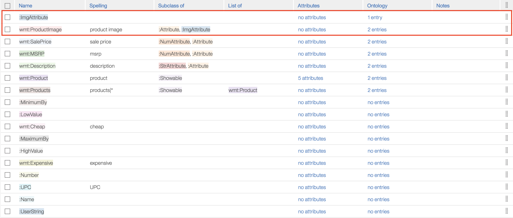

## Image attributes

EBA has released an additional attribute type across our system, viz. `:ImgAttribute`. Like our other attribute types--`:NumAttribute`, `:StrAttribute`, `:DateAttribute`--developers can declare their entity attributes as subclasses of `:ImgAttribute`, enabling our system to provide assistance in showing and classifying such data. Currently, we require all attribute subclasses to model images using URL fields. 

By subclassing an image url attribute from `:ImgAttribute`, you enable following functionality:

- ability to render images in data view within chat
- ability to classify images to identify what an image portrays
- ability to detect faces in an image

Below we illustrate an example of how our [Walmart sample](../../samples/walmart.yaml) leverages this feature:

