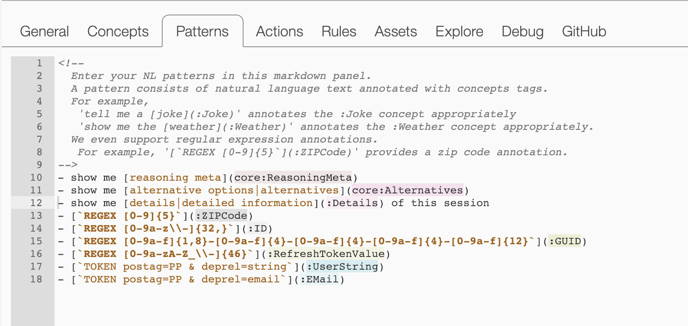

## Markdown patterns syntax and editor

We are glad to announce a new, more flexible syntax for EBA NL patterns! This new syntax is compact, human readable, and reuses an existing standard (Markdown). Additionally, it introduces new support for language synonyms and regular expressions which lends itself to a more seamless NLU development process. As a result of these decisions, NL patterns are now represented and developed within a code editor rather than in tabular fashion as beforehand. 

[](../nl-patterns.png)

With respect to the syntax itself, we follow the same syntax one would expect when working with links in Markdown. As an illustration, we would migrate the following pattern from the old syntax to new syntax like this:

```
Old syntax
tell me a {joke|:Joke}

New syntax
tell me a [joke](:Joke)
```

Synonyms support for patterns has been an awaited request from our users, and with this new syntax it is possible to consolidate multiple synonyms directly into one line. Previously each synonym required a separate entry.

REGEX annotation support is now provided directly within NL patterns. This feature can be particularly useful in business use cases as identifiers and names often follow an established format. REGEX support previously required the implementation of our `@annotate` endpoint--too much overhead for a simple task. The underlying NL data associated with this annotation is directly supplied to semantic actions and accessible via our `Params` interface without requiring an additional action to extract this data manually.

Inline comments, highlighting, and global search/replace capabilities are provided by the ace code editor in which developers implement their patterns.

Note: all existing patterns are automatically migrated to this new syntax, including native EBA agents.
