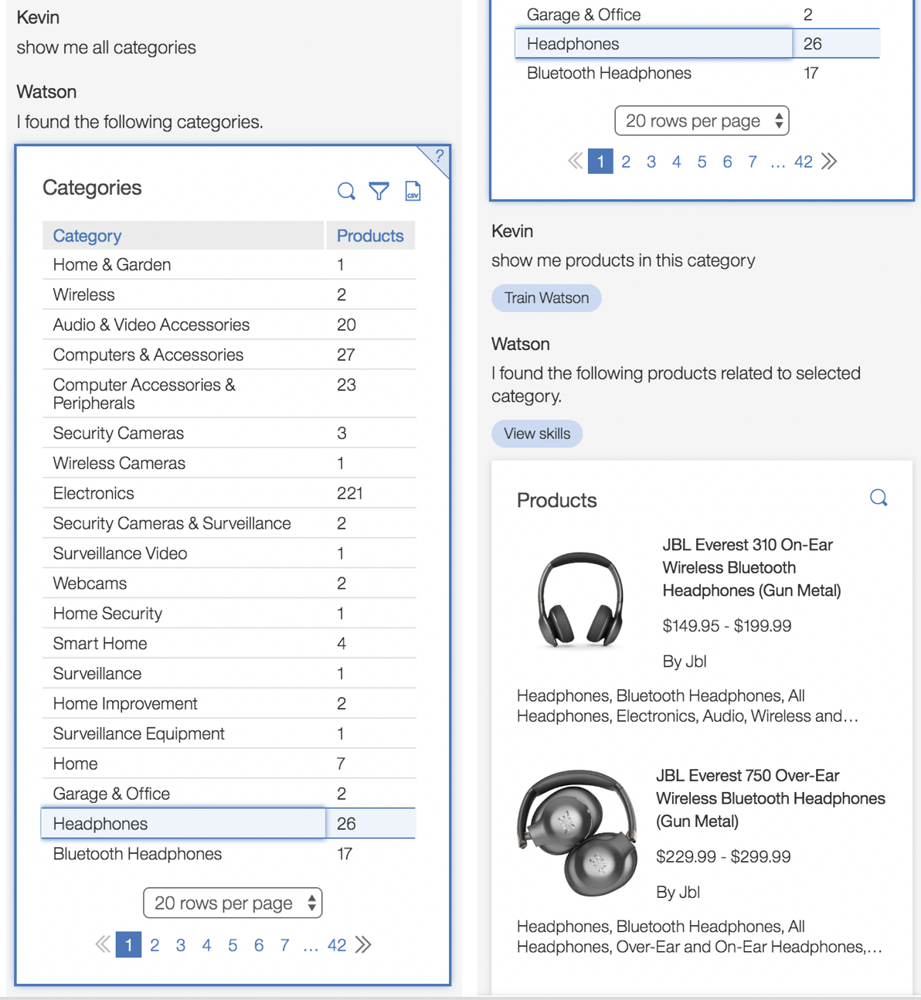

## Multimodal UI context

EBA now supports multimodal UI interactions and context, where users can now point to certain elements within our UI to bring them into the context of the conversation where EBA can further reason about them. Follow up questions about focused UI elements can be asked in the standard chat panel or using our open microphone support. To reference such elements from within our context users can use deictic terminology such as 'it', 'this', 'here', etc. With the introduction of multimodal UX, users can being to engage with our systems more seamlessly through vocal and visual interfaces, where subsequent data transformations and insights can be powered by visual elements which the assistant can understand.

As an illustration, we model an example below where a user inspects a set of product categories within an UI table component. Selecting a particular category from the UI, he then asks a follow-up question using the term "this category". Because the category has been brought into the reasoning context, EBA is able to understand that the products which the user requests pertain the selected category, viz. headphones, as indicated by the NLG response.

For details on how to implement such interactive UI components, developers may consult our [focused multi-modal UI documentation](../../docs/lab/assets/frontend/FocusedUI.md)

_This feature includes an [award winning award multi-modal AI assistant techonlogy](ibm.biz/tyson-demo) from IBM research. For more information about this technology, please contact Jeff Kephart (kephart@us.ibm.com)._
