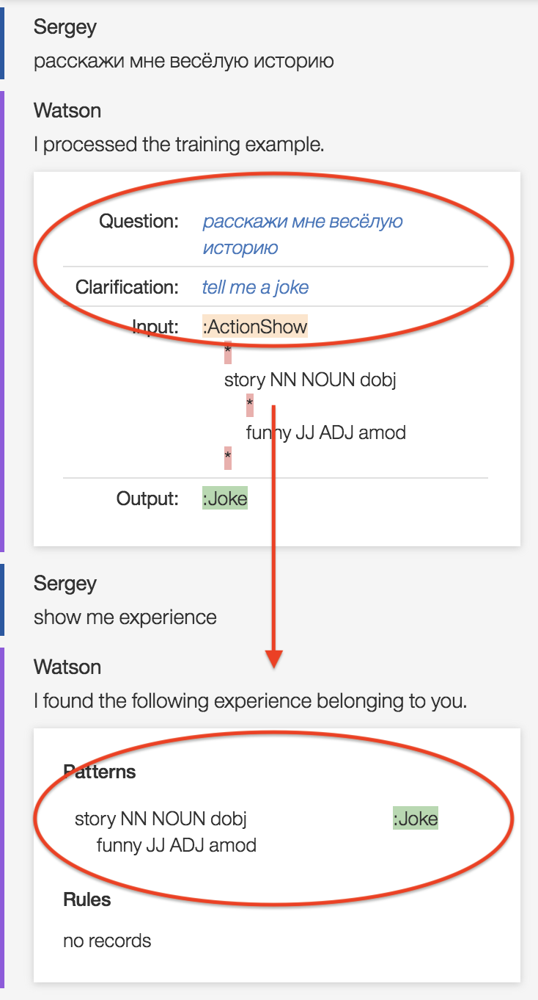

## Language translator for training

[EBA NLTraining](./blogs/AgentLearning.md) is now powered by natural language translator, enabling EBA to learn on foreign langauge inputs. EBA natively supports foriegn language translation for a variety of languages. If EBA detects that a foriegn language is used, it will execute both the original language as well as english translation of the original in parallel, and it will select the variant with the highest score to resolve a user's input. Before this release, it was not possible to train the system on this english translation in the event that it was selected to resolve a question but the system still could not understand the question. With our new translation support, it is now possible to provide a clarification to this translated input, so that EBA will understand such translations in subsequent interactions.

### An illustration

Below is an example where EBA intially cannot resolve the Russian input 'расскажи мне весёлую историю'. It neither understands the original input as is, nor the English translation 'tell me a funny story'. As a clarification, we can tell EBA that 'расскажи мне весёлую историю' is conceptually equivalent to 'tell me a joke'. EBA will then generate the NL components on the translated text during its traning process. In the example below, this means that EBA will introduce a pattern `[funny story](:Joke)`. We should note that such training is not limited to the foreign language only. If you now ask in plain english 'tell me a funny story', EBA will apply the generated pattern to resolve the user's input. As a high level interaction, we see that this feature gives users the ability to teach EBA Russian by using English clarications, much like we would expect in a human-to-human interaction with a new foriegn language learner.

