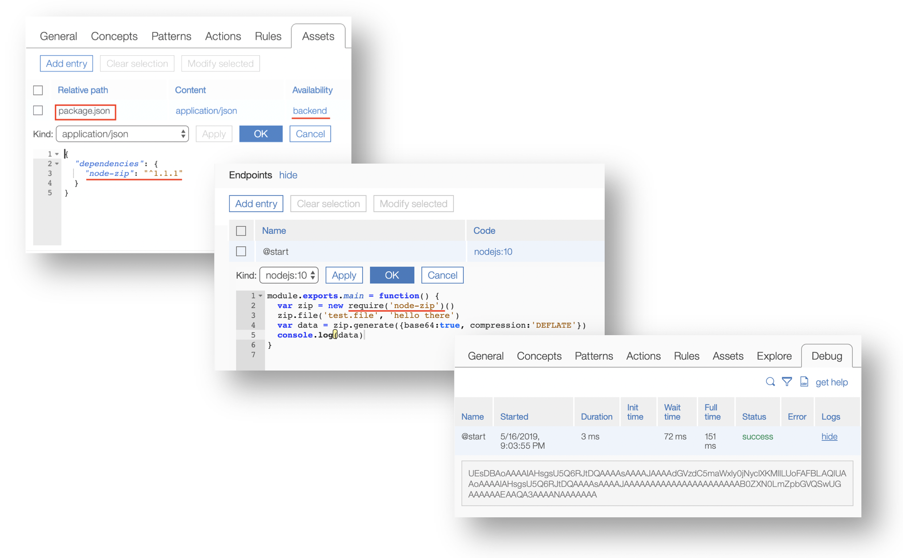

## Package.json dependencies

EBA development lab now provides a convenient interface for allowing developers to add custom, external dependencies to an agent. While EBA provides support for external runtimes, the _de facto_ execution environment for EBA remains IBM Cloud FaaS. For the javascript environment, a number of common node modules come pre-packaged in this environment. However, there are often cases where developers may desire some additional external dependencies. For instance, we find that a popular module for working with .zip files is not pre-packaged for us. By simply including a backend asset titled 'package.json' with content type 'application/json', developers are able to declare any _publicly accessible_ module. In order to add depedencies, simply add a key titled "dependencies" to your json, where the value of this key is an object containing the modules you wish to load along with their respective version. For instance, to add a dependency for 'node-zip', you enter the following into package.json.

```
{
  "dependencies": {
    "node-zip": ^1.1.1"
  }
}
```


Note that, within package.json, modules do not need to be published on npm in order to be downloaded. It is enough to provide a github url to your module. This has an import consequence for EBA developers. It enables developers to share backend assets across various agents by declaring them within package.json. This does come with one non-substantial caveat, which is that your backend modules which you intend to reuse across agents must be publicly accessible.

With this release developers may also declare the following Node.js configuration files:
- package.json
- package-lock.json
- .npmrc

Below is an illustration of package.json at work to utilize the .zip module referenced above:


[](../images/packagejson-example.png)
