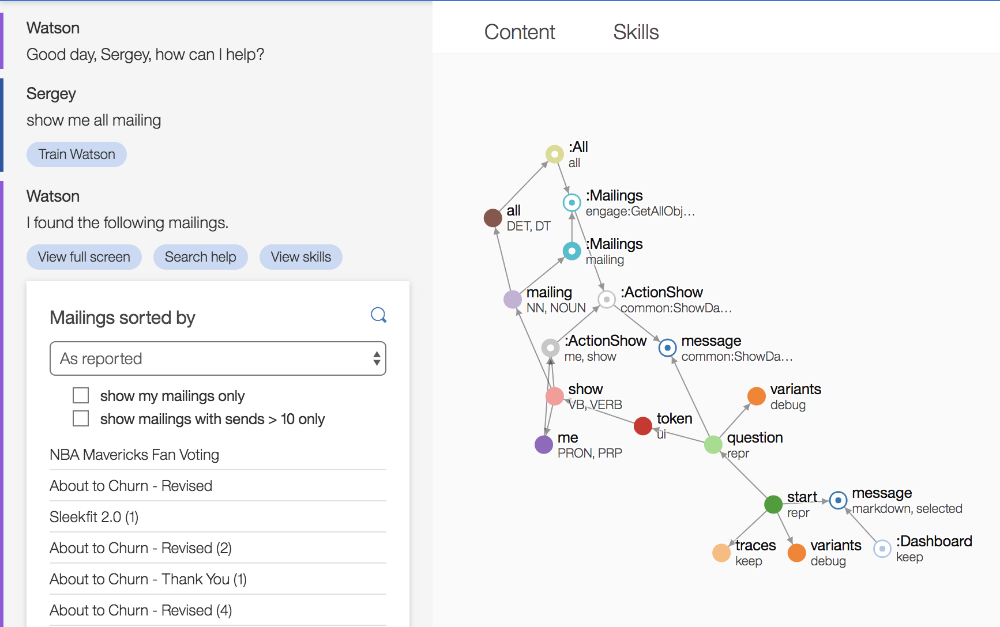

## Plural and singular entity resolution

EBA now has the ability to deduce the correct form of a noun (plural or singular) based on the context and reasoning. If a user asks for a set of orders in the singular form, EBA will still be able to understand and provide the correct response to end users, as demonstrated in the screenshot below.

It is important to understand that EBA, as an ontology based reasoning engine, naturally distinguishes between a single entity and a collection of such entities. Using the `isListOf` predicate, users can denote list relationships, where such relationships enable our reasoning core to provide useful aggregation and statisical functionality when querying collections of data. From an NLU point of view, EBA enforces the semantical and syntatical constraints implies by this relationship. For instance, 'order' as a singular form token cannot be annotated by the concept `:Orders` given we have provided a list relationship. If we ask for orders, EBA will produce data for `:Orders` and, if we ask for a single order, EBA will produce data for a single `:Order`. However, this can sometime lead to overly strict behavior for end users, as in the case of mistyping, where a user may ask 'show me order which are late'. Whereas our system was previously unable to produce the expected result because 'order', as a single entity, did not support such aggregation, now it can. With this new release, EBA will apply a fallback, secondary check to detect when singular and plural mismatches are at play. Being able to detect these cases enables us to provide a richer experience to users without sacrificing certain key principles of distinguishing list relationships within an ontology.
