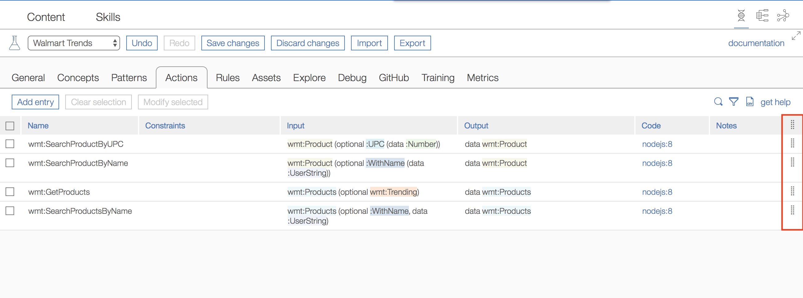

## Table ordering

EBA dev lab, which makes heavy use of our table constructs, now allows table rows to be reorder by users. In particular, you will find in each table an additional column with a vertical grip icon. Row entries within a table can be reordered by dragging elements via this icon to their desired location. This feature allows users to provide custom organization across their entries, e.g. to group similar concept in close proximity. Additionally, we find that this feature is required in order to flexibly implement agent training, where the order of entries determines the cumulative training effects. Below is an illustration of this capability.

