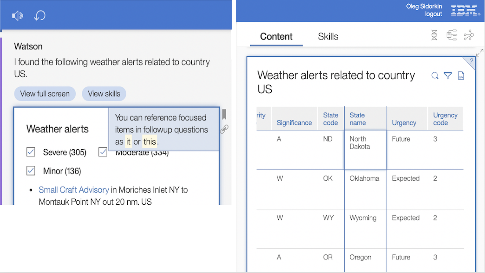

## Virtual UI context

In partnership with IBM Symbiotic Cognitive Computing, EBA now supports virtual UI context, where users can point to certain elements within our UI to bring them into the context of the conversation where EBA can reason about them. Follow up questions about focused UI elements can be asked in the standard chat panel or using our open microphone support. To reference such elements, which are within our implicit context, users can use the terms 'it', 'this', etc. What we illustrate in the two following screenshots are a few UI elements which are selected for focus (note the thick blue borders surronding such content). In these examples, all of the following elements will be brought into EBA's context, viz. the weather alerts table, a specific weather alert (the selected row), state name (the column name), and North Dacota (the cell). 

