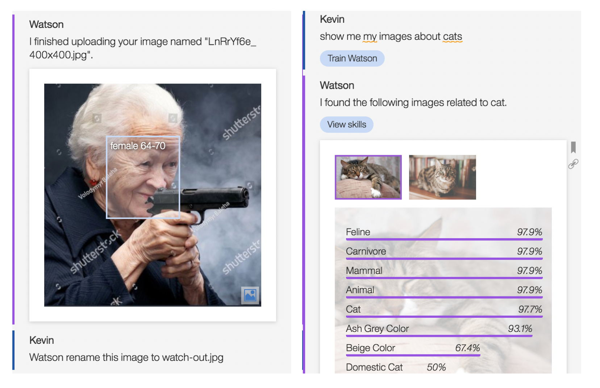

## Watson visual recognition agent

The EBA ecosystem of agents now features a new member--Watson Visual Recognition agent. This agent is based on Watson VR apis, which allow us to run classifications on top of images, including face detection. Through natural langauge, users of this agent are able to upload and manage a collection of images and to ask questions concerning Watson VR output and other meta data about their images. Additionally, this agent provides support for classifying [native image attributes](./ImageAttributes.md) across our system. 

You are welcome to try out the following types of questions:
- Watson, upload an image
- whats on this image
- show me faces on this image
- Watson, rename this image to new-name.jpg
- show me all my images
- show me my images about cats
- Watson, delete all my images

