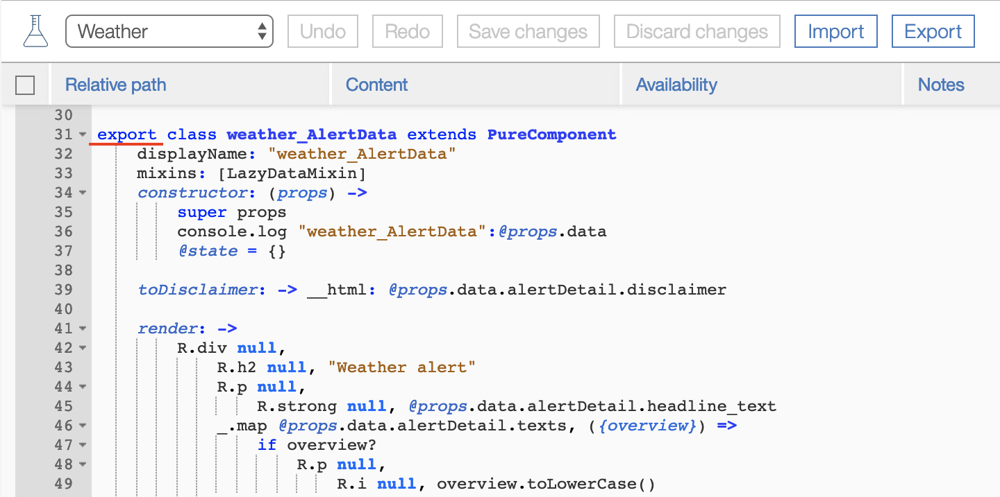

## Webpack assets

To ease the life of developers who are implementing the client side presentation of their data, we have introduced support of bundled Javascript modules using Webpack. Before the release of this feature, there were, admittedly, some pain points with developing frontend assets, particularly as it pertains to sharing and loading dependent components. With this feature, EBA provides the following benefits to developers:
* Frontend code is transpiled, bundled and minified
* Users can share code across components
* There is no dependency on loading order anymore
* Frontend assets will be safely unloaded on agent change or deactivation
* There will be no pollution of a global scope with custom components
* 3rd party libraries will be isolated in agent bundles

To enable Webpack bundling, we only require to two steps to be followed:

First, within the 'General' tab, click the checkbox next to 'Use webpack to bundle frontend assets.

Secondly, `export` your components programmatically.

### Some use cases to consider

This use case will be particularly useful for developers who intend to use some third party javascript module on the client side. This library, which can be quite large, will be isolated from the agent itself.

Other suitable use cases are when certain components require substantive reuse. Previously this required all relevant code to be consolidated into a single file. Without a dependency on loading order, this is no longer a issue.

